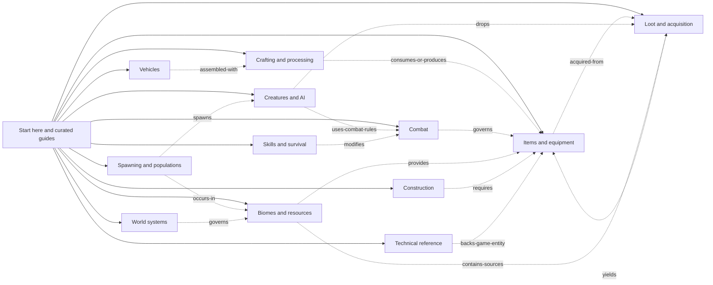

# Repository and pipeline map

Generated from `project.json` by `py -3 wiki.py map`. Do not edit this file.

GitHub names below are reserved design names; no remotes have been created.

| Repository | Local checkout | Intended GitHub name | Content ownership |
| --- | --- | --- | --- |
| Start here | `repositories/hub` | `HumanHost-Wiki` | Topic overview, curated guides, version selection, coverage and release history |
| Items and equipment | `repositories/items-equipment` | `HumanHost-Wiki-Items` | All known items, weapons, armor, tools, consumables, materials and their properties |
| Loot and acquisition | `repositories/loot-acquisition` | `HumanHost-Wiki-Loot` | Loot eligibility, tables, containers, drops, acquisition conditions and source-to-item relationships |
| Crafting and processing | `repositories/crafting-processing` | `HumanHost-Wiki-Crafting` | Recipes, ingredients, workbenches, processing, repairs and disassembly |
| Combat | `repositories/combat` | `HumanHost-Wiki-Combat` | Damage calculations, armor interactions, body-part effects and weapon mechanics |
| Creatures and AI | `repositories/creatures-ai` | `HumanHost-Wiki-Creatures` | Creature variants, perception, movement, targeting and attacks |
| Spawning and populations | `repositories/spawning-populations` | `HumanHost-Wiki-Spawning` | Spawn rules, population groups, distances, despawning and cleanup |
| Skills and survival | `repositories/skills-survival` | `HumanHost-Wiki-Survival` | Progression, buffs, health, stamina, hunger, thirst and status effects |
| Biomes and resources | `repositories/biomes-resources` | `HumanHost-Wiki-Biomes` | Regional resources, items, creatures and loot; unique or exclusive occurrences only where verified |
| Construction | `repositories/construction` | `HumanHost-Wiki-Construction` | Building pieces, materials, durability, destruction and structural relationships |
| Vehicles | `repositories/vehicles` | `HumanHost-Wiki-Vehicles` | Vehicle families, parts, assembly, controls and operating mechanics |
| World systems | `repositories/world-systems` | `HumanHost-Wiki-World` | Weather, time, environmental conditions and world organization |
| Technical reference | `repositories/technical-reference` | `HumanHost-Wiki-Technical` | Every asset identity, component types, configuration fields, tags, layers and visible coverage gaps |

## Navigation and topic relationships

Solid edges are entry navigation; dotted edges describe representative semantic links.
They are not build dependencies. Semantic cycles and backlinks are expected.

## Build dependencies

```mermaid
flowchart LR
  detect["detect: planned"]
  capture["capture: external-existing"]
  detect --> capture
  register["register: implemented"]
  capture --> register
  normalize["normalize: planned"]
  register --> normalize
  identity["identity: planned"]
  normalize --> identity
  project["project: planned"]
  identity --> project
  verify["verify: planned"]
  project --> verify
  release["release: planned"]
  verify --> release
  publish["publish: planned"]
  release --> publish
```

| Stage | Owner | Implementation |
| --- | --- | --- |
| detect | operator-invoked decompile pipeline | planned |
| capture | HumanHostMods/tools/Decompile-GameCode.ps1 | external-existing |
| register | wikibuild/snapshots.py | implemented |
| normalize | future wiki adapters | planned |
| identity | future identity registry | planned |
| project | future topic projectors | planned |
| verify | future semantic and link validation | planned |
| release | future release coordinator | planned |
| publish | future GitHub Pages publisher | planned |

The navigation preview is an independent foundation build, not the publish stage above.
