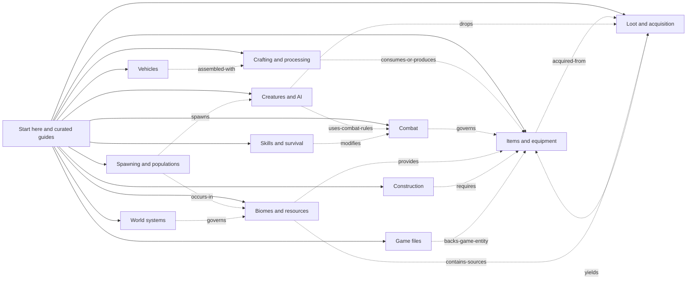

# Repository and pipeline map

Generated from `project.json` by `py -3 wiki.py map`. Do not edit this file.

GitHub names below are configured destinations. Publication receipts record verified remote state.

This map shows logical topics. Release manifests record additional physical storage repositories;
the [capacity contract](CAPACITY.md) defines their ownership, allocation and recovery.

| Repository | Local checkout | Intended GitHub name | Content ownership |
| --- | --- | --- | --- |
| Start here | `repositories/hub` | `HumanHost-Wiki` | Topic overview, curated guides, version selection, coverage and release history |
| Items and equipment | `repositories/items-equipment` | `HumanHost-Wiki-Items` | All known items, weapons, armor, tools, consumables, materials and their properties |
| Loot and acquisition | `repositories/loot-acquisition` | `HumanHost-Wiki-Loot` | Loot eligibility, tables, containers, drops, acquisition conditions and source-to-item relationships |
| Crafting and processing | `repositories/crafting-processing` | `HumanHost-Wiki-Crafting` | Recipes, ingredients, workbenches, processing, repairs and disassembly |
| Combat | `repositories/combat` | `HumanHost-Wiki-Combat` | Damage calculations, armor interactions, body-part effects and weapon mechanics |
| Creatures and AI | `repositories/creatures-ai` | `HumanHost-Wiki-Creatures` | Creature variants, perception, movement, targeting and attacks |
| Spawning and populations | `repositories/spawning-populations` | `HumanHost-Wiki-Spawning` | Spawn rules, population groups, distances, despawning and cleanup |
| Skills and survival | `repositories/skills-survival` | `HumanHost-Wiki-Survival` | Progression, buffs, health, stamina, hunger, thirst and status effects |
| Biomes and resources | `repositories/biomes-resources` | `HumanHost-Wiki-Biomes` | Regional resources, items, creatures and loot; unique or exclusive occurrences only where verified |
| Construction | `repositories/construction` | `HumanHost-Wiki-Construction` | Building pieces, materials, durability, destruction and structural relationships |
| Vehicles | `repositories/vehicles` | `HumanHost-Wiki-Vehicles` | Vehicle families, parts, assembly, controls and operating mechanics |
| World systems | `repositories/world-systems` | `HumanHost-Wiki-World` | Weather, time, environmental conditions and world organization |
| Game files | `repositories/technical-reference` | `HumanHost-Wiki-Technical` | Every asset identity, component types, configuration fields, tags, layers and visible coverage gaps |

## Navigation and topic relationships

Solid edges are entry navigation; dotted edges describe representative semantic links.
They are not build dependencies. Semantic cycles and backlinks are expected.

## Build dependencies

```mermaid
flowchart LR
  capture["capture: external-existing"]
  register["register: implemented"]
  capture --> register
  availability["availability: implemented"]
  register --> availability
  external-articles["external-articles: implemented"]
  availability --> external-articles
  normalize["normalize: implemented"]
  external-articles --> normalize
  identity["identity: implemented"]
  normalize --> identity
  project["project: implemented"]
  identity --> project
  external-articles --> project
  verify["verify: implemented"]
  project --> verify
  release["release: implemented"]
  verify --> release
  retention["retention: implemented"]
  release --> retention
  reader-retention["reader-retention: implemented"]
  retention --> reader-retention
```

| Stage | Owner | Implementation |
| --- | --- | --- |
| capture | HumanHostMods/tools/Decompile-GameCode.ps1; installed-input detection and capture reuse | external-existing |
| register | wikibuild/snapshots.py | implemented |
| availability | wikibuild/availability.py; Steam branch observations are independent of gameplay verification | implemented |
| external-articles | wikibuild/external_links.py and mediawiki.py; bounded versioned article checks | implemented |
| normalize | wikibuild/extraction.py and topic adapters | implemented |
| identity | wikibuild/identity.py, model.py and history.py | implemented |
| project | wikibuild/reader.py, curation.py, curated_rules.py, external_links.py, packs.py, pages.py and web/ | implemented |
| verify | reader artifact checks, declared claim checks and independent tools/check_*.py; runtime verification remains explicitly scoped | implemented |
| release | wikibuild/release.py and git_transaction.py; selected-fact Git releases | implemented |
| retention | wikibuild/release_retention.py; local update housekeeping | implemented |
| reader-retention | wikibuild/reader_retention.py; final local update stage | implemented |

The navigation preview is an independent foundation build. Production publication is a separate gated operator command; see [PUBLICATION.md](PUBLICATION.md).
